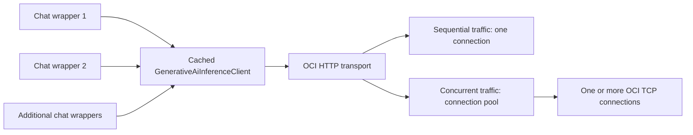
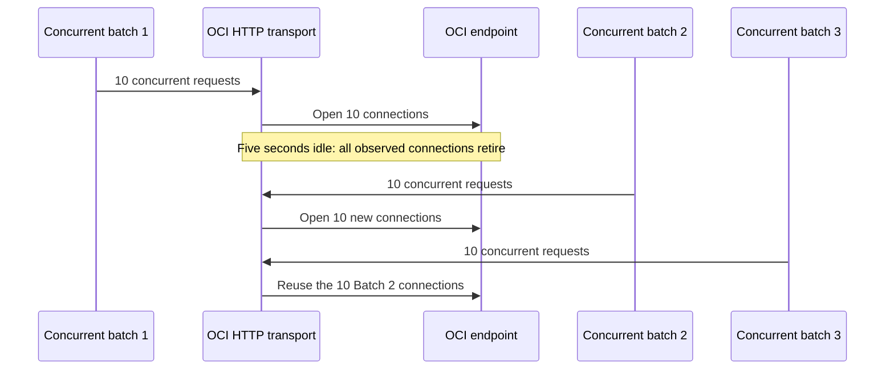

# OCI Generative AI Chat and Embeddings Nodes

## Purpose

Provide OCI Generative AI chat-model and embeddings integrations for n8n AI workflows, using the pre-release `@oracle/langchain-oci` package until its npm release.

## Scope

| Area | Implementation |
| --- | --- |
| Credentials | `ociGenAiApi` supports API key, instance principal, resource principal, and OCI config-file session authentication. |
| Chat | `LmChatOciGenAi` supplies an OCI LangChain chat model to AI Agent workflows. |
| Embeddings | `EmbeddingsOciGenAi` supplies OCI embeddings to vector-store and RAG workflows. |
| Icons | Both nodes use the shared Oracle SVG icon. |
| Package source | `@oracle/langchain-oci` remains a local tarball reference temporarily; replace it with an npm version when published. |

## Credential and Request Handling

- API-key private keys accept JSON-escaped line breaks and are normalized before being passed to the OCI SDK.
- Model and compartment IDs are validated before they reach OCI.
- The optional advanced inference endpoint must be HTTPS and exactly match the configured OCI region and its realm as resolved by the OCI SDK. It cannot contain user credentials, ports, paths, query parameters, or fragments. Leaving it empty uses the SDK-derived endpoint.
- OCI credentials do not run an automatic connection test. The model and compartment configured on each node determine whether inference is authorized.

## Model Selection

- Chat-model discovery calls OCI's management API with `Chat` capability and optional vendor filters. Vendor filters are normalized identifiers (letters, numbers, hyphens, and underscores; maximum 64 characters), rather than a fixed provider allowlist, because OCI can add vendors without an n8n release.
- Management model OCIDs are converted to provider model IDs when OCI inference requires a provider ID.
- Retired on-demand models are omitted from the chat selector.
- Embeddings use a curated, region-aware fallback rather than treating OCI management discovery as the sole source of truth. The catalog can discover TEXT_EMBEDDINGS capability, but its response alone does not establish current on-demand serving availability in a region. Keep the fallback aligned with OCI Models by Region; manual model ID entry supports newly released models. A future hybrid selector can use discovered models after a reliable serving-mode signal is available. Available Embed 3 entries are labelled deprecated.
- In dedicated Chat and Embeddings mode, the endpoint identifies the hosted model. The on-demand model selector is hidden and is not read or validated. Chat also hides its on-demand vendor filter and shows the standard connection hint for AI chains and agents.
- Output Dimensions uses a model-capability lookup. It currently has a documented fallback for `cohere.embed-v4.0`: 256, 512, 1,024, and 1,536. Default leaves the parameter unset, so OCI selects its native default of 1,536. Models without verified metadata show a custom positive-integer field, allowing a user to send an override to OCI. Execution validates fallback models locally; OCI remains the capability authority for new, manually entered, and dedicated models. Replace the fallback with OCI catalog metadata when that metadata is reliably available.
- Embedding truncation defaults to `None`, matching the OCI Console. Oversized input returns an error unless the user explicitly selects `Start` or `End`; truncation is a safety net, not a substitute for upstream chunking.
- Chat catalog pages are cached for 60 seconds. Cache entries are isolated by non-secret authentication identity, region, compartment, vendor, capability, and page token. The cache is bounded with insertion-order eviction, shares in-flight requests, and normalizes/sorts models once so typeahead only filters local search text.
- Inference clients are cached for 60 seconds by non-secret authentication identity, region, and validated endpoint. This lets Agent tool-resume passes reuse the same OCI client even though n8n creates a fresh LangChain wrapper per pass. The 32-entry insertion-order cache shares in-flight creation and removes expired entries without closing clients that an in-flight workflow may still be using. A credential update with the same cache identity takes effect when the current entry expires.

## Client and Connection Lifecycle

- The inference-client cache limits `GenerativeAiInferenceClient` and authentication-provider creation. It does not impose a limit on TCP connections.
- An OCI LangChain wrapper receives the cached client as an injected, caller-owned client. Its first request initializes the wrapper's internal SDK-client reference. Later requests on that same wrapper reuse the reference. New wrappers initialize their own reference but receive the same cached inference client.
- A wrapper's `close()` does not close an injected client. n8n does not currently invoke wrapper `close()` at the end of every workflow. Cache expiry removes the cache reference without closing the client so active workflows are not interrupted; process shutdown provides final operating-system socket cleanup.
- Socket observations from the local diagnostic showed one cached OCI client serving eleven chat wrappers. Sequential requests reused one OCI TCP connection. Ten concurrent requests opened ten TCP connections to the same OCI endpoint. This is expected connection-pool concurrency, not evidence that ten SDK clients were created.
- Client lifetime and connection lifetime are separate. A single SDK client can own a transport pool with several simultaneous connections. Do not serialize OCI requests merely to reduce socket count, because that would reduce throughput and increase latency.
- The local diagnostic observed ten connections after its first ten-request concurrent batch and zero after five seconds idle. A second batch then opened ten new connections because the pool was empty. An immediate third batch reused all ten of the second batch's local endpoints. This shows idle retirement and active-pool reuse for the tested OCI transport.
- The socket diagnostic records observations instead of asserting a fixed connection count. Its default timings are five and 30 seconds; `OCI_SOCKET_IDLE_SECONDS` and `OCI_SOCKET_EXTENDED_IDLE_SECONDS` can shorten or extend those local observations.
- The standalone OCI integration scripts run only when `OCI_GENAI_MODEL` and `OCI_GENAI_COMPARTMENT_OCID` are set. Otherwise they print a skip message and exit successfully. OCI authentication and region remain sourced from the configured default OCI profile.





## OCI Compatibility

- Tool schemas remove `$schema`, which OCI function declarations do not accept.
- OCI chat accepts plain strings and text-only LangChain content blocks. The OCI adapter converts empty AI-message content accompanying tool calls to an empty string, which OCI accepts. It rejects images, audio, documents, and mixed content until OCI multimodal conversion is explicitly implemented.
- The chat node subclasses the OCI chat model instead of binding it, preserving chat-model capabilities such as tool binding for downstream n8n agents.

## Implementation TODO

- [x] Add OCI credentials, chat node, embeddings node, and Oracle icons.
- [x] Add shared OCI client, validation, and model-catalog utilities.
- [x] Add OCI request compatibility handling for tools and structured messages.
- [x] Add input-validation, endpoint-validation, catalog-cache, inference-client-cache, and node configuration unit coverage.
- [x] Add a local OCI socket diagnostic that exercises repeated requests on one wrapper, new wrappers sharing the inference-client cache, and concurrent requests.
- [x] Add a standalone OCI chat integration check separate from the socket diagnostic.
- [x] Observe idle socket behavior and connection reuse across repeated concurrent batches with the local OCI diagnostic.
- [ ] Replace the local `@oracle/langchain-oci` tarball with its published npm package.

## Verification

### Automated

Run from `packages/@n8n/nodes-langchain`:

```bash
pnpm test credentials/test/OracleCloudGenAiApi.credentials.test.ts utils/ociGenAi.test.ts nodes/llms/LmChatOciGenAi/test/LmChatOciGenAi.test.ts nodes/llms/LmChatOciGenAi/test/OciMessageContent.test.ts nodes/embeddings/EmbeddingsOciGenAi/test/EmbeddingsOciGenAi.test.ts
pnpm typecheck
pnpm lint
pnpm exec tsx nodes/llms/LmChatOciGenAi/test/oci.int.ts # Runs only when OCI_GENAI_MODEL and OCI_GENAI_COMPARTMENT_OCID are set
pnpm exec tsx nodes/llms/LmChatOciGenAi/test/oci-sockets.int.ts # Runs only when OCI_GENAI_MODEL and OCI_GENAI_COMPARTMENT_OCID are set
```

### Manual

1. Create an **OCI Generative AI API** credential with a valid authentication method and Region ID. Leave **Inference Endpoint (Advanced)** empty for the standard region-derived endpoint.
2. On the Chat node, enter a valid compartment OCID and open the model selector. Type several characters and confirm results filter without repeated loading delays. Select an on-demand chat model and connect it to an AI Agent.
3. Invoke the agent with a plain prompt, a tool call, and structured message content. Confirm text responses, streaming, and tool calls complete successfully.
4. On the Embeddings node, select **Cohere Embed 4** and confirm **Output Dimensions** offers Default plus 256, 512, 1,024, and 1,536. Select a different or manually entered embedding model and confirm the field accepts a custom positive integer. Connect it to a vector store or embedding consumer and confirm it creates vectors with the dimension expected by the vector index.
5. For dedicated serving, select **Dedicated** and enter an endpoint OCID. Confirm leaving the endpoint ID empty produces the expected validation error.
6. Optionally set the advanced endpoint to the exact inference host for the selected region and realm. Confirm a mismatched realm, non-HTTPS URL, path, port, query, fragment, or credentials is rejected.
7. To verify OCI chat integration locally, configure the default `~/.oci/config` profile, then set `OCI_GENAI_COMPARTMENT_OCID` and `OCI_GENAI_MODEL`. From `packages/@n8n/nodes-langchain`, run `pnpm exec tsx nodes/llms/LmChatOciGenAi/test/oci.int.ts`.
8. To inspect OCI client and socket behavior locally, run `pnpm exec tsx nodes/llms/LmChatOciGenAi/test/oci-sockets.int.ts`. Review the sequential, same-wrapper, new-wrapper, idle, and three concurrent-batch socket snapshots. Do not treat a concurrent socket count above one as a leak by itself. The output compares reused, new, and retired local endpoints. Set `OCI_SOCKET_IDLE_SECONDS` or `OCI_SOCKET_EXTENDED_IDLE_SECONDS` to adjust the observation intervals.
